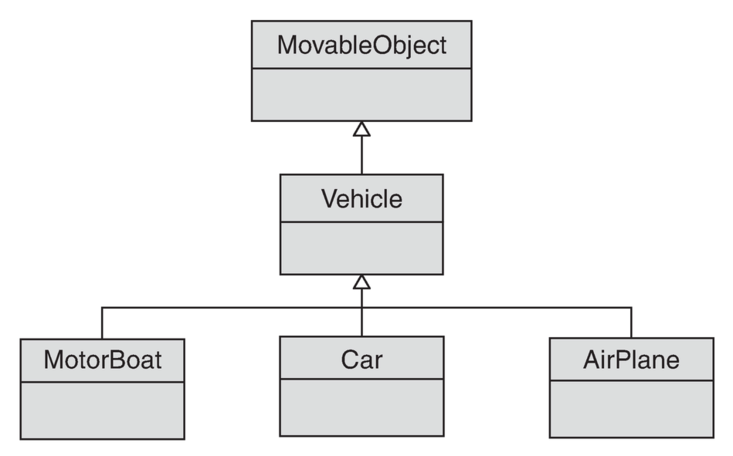
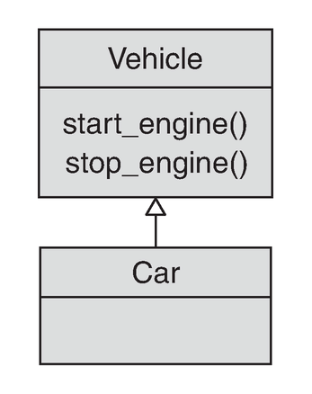
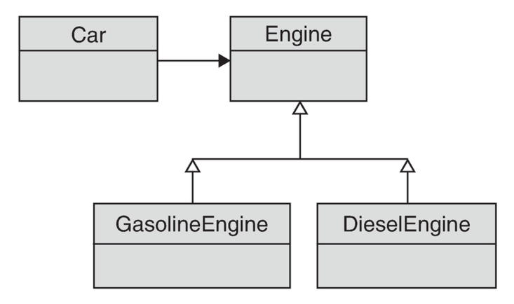

# NYP - İlkeler

.fx: first

Recai Oktaş `<roktas@bil.omu.edu.tr>`

[http://roktas.me/](http://roktas.me/)

Nisan 2012

---

# Miras Alma

---

# UML Diyagramları

Sınıf ilişkilerini UML diyagramlarıyla gösteriyoruz

- Bir modelleme aracı

- **Unified Modelling Language**

- Tasarım sırasında yararlı

---

# UML Diyagramları

- "Miras Alma" ilişkisi ebeveyn sınıfa doğru içi boş bir ok

---

# Miras Alma - `is-a`

"Miras Alma" bir `is-a` ilişkisi kurar

- `Car` **`is a`** `Vehicle`: Araba bir Araçtır

Bu ilişkinin doğal olması lazım

- Aksi halde hatalı bir soyutlama yapmış olursunuz

- Hatalı soyutlamanın bedeli?

- Karmaşık ve kırılgan kod

- Yapboz'da yerine oturmayan parçalar

---

# Miras Alma (Hatalı Soyutlama)

---

# Miras Alma (Hatalı Soyutlama)

.code: code/rb_inheritance_vs_composition_vehicle/main1.rb

---

# Miras Alma - `is-a`

`Car` **`is a`** `Vehicle`: Araba bir Araçtır

- Yukarıdaki cümle kulağa doğru geliyor; fakat...

- İsimlendirmelere aldanmayın, modele bakın

- "Araç" nasıl modellenmiş? `Vehicle` sınıfıyla

- `Vehicle`?  "Motoru olan bir nesne" üretir

---

# Hatalı soyutlama

Her aracın (vasıta'nın) bir motoru var mıdır?

- Bisiklet?

- Planör?

- Kayık?

---

# Doğru Soyutlama

Bize başka bir soyutlama lazım

- Her aracın motoru olmayabilir

- "Araba moturu olan bir araçtır"

---

# Komposizyon

- "Komposizyon" ilişkisi kompoze **edilen** sınıfa doğru içi dolu bir ok

---

# Kompozisyon - `has-a`

"Kompozisyon" bir `has-a` ilişkisi kurar

- `Car` **`is a`** `Vehicle`, that **`has an`** `Engine`

- "Araba motora sahip bir Araçtır"

- Bakın bu farklı bir model

---

# Komposizyon

.code: code/rb_inheritance_vs_composition_vehicle/main.rb

---

# Kompozisyon veya Miras Alma?

**Mümkün olan her yerde "Komposizyon"u, "Miras Alma"ya tercih edin.**

- Bir modellemenin eşiğindesiniz

- Hemen `is-a` ve `has-a` ilişkilerini tayin edin

- Model'e alternatif açılardan bakın

- `is-a` ilişkisi çok doğal olmalı

- Doğal değilse `has-a` ilişkisini arayın

- Doğallık şüphesi varsa `has-a`

---

# Komposizyon ve Miras Alma

Bazen "Kompozisyon" ve "Miras Alma" birlikte kullanılabilir

---

# Komposizyon ve Miras Alma

.code: code/rb_inheritance_plus_composition_vehicle/main.rb

---

# Delegasyon

"Komposizyon"lu modelde motorun çalışma aklı nerede?

- Motorda ama bir kısmı Araba'ya sızmış gibi: `car.start`

- Araba motorun çalışmasına bu kadar yakın olmamalı

- Araba modelinin müşterisi motorun çalışmasıyla ilgilenmez

Ne yapmalı?

---

# Delegasyon

Araba içinde motorun çalışmasıyla ilgili tüm işler motora devredilmeli

- `Car` sınıfında motorla ilgili tüm işler `Engine` sınıfına bırakılmalı

- `Engine` sınıfı "motor işleri"ni temsil ediyor

- "Motor"un delegasyonu

---

# Delegasyon

.code: code/rb_delegation_vehicle/main.rb
